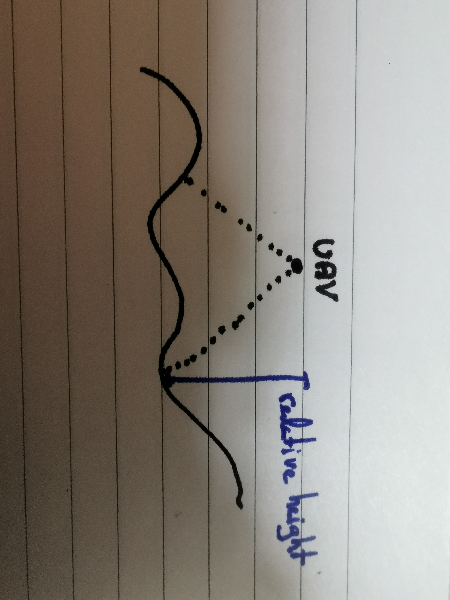
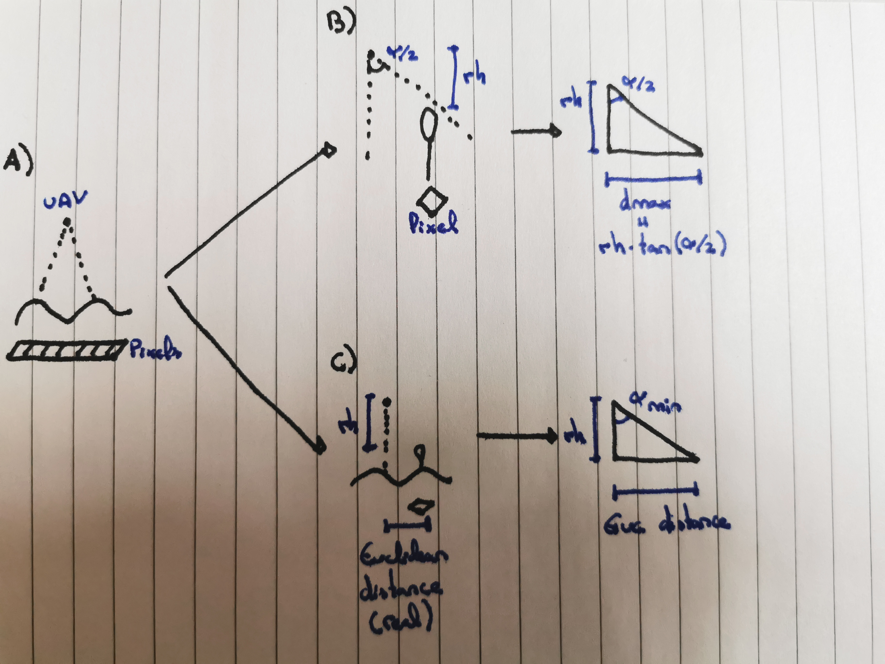
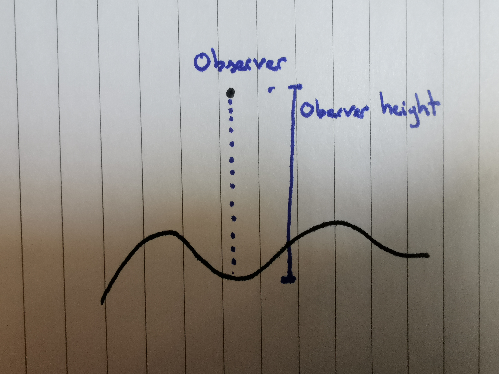

```{r setup, include=FALSE}
knitr::opts_chunk$set(echo = TRUE, warning = FALSE)
```

# Description

The goal of this task is to delineate the footprint of aerial LiDAR data. To do so, we will need:

-   A Digital Surface Model (DSM)

-   Scan angle

-   Height above sea level of the UAV

-   Coordinates of UAV position

Some important notes:

-   Use a projected coordinates reference system

# Required data

First of all we will load the necessary packages to accomplish this task

```{r}
## Install pacman if not installed
if (!require(pacman)) install.packages("pacman")
## Load pacman
library(pacman)
## Install + load rest of the packages
p_load(
  colorRamps, ggimage, lidR, sf, terra, tidyterra, tidyverse
)
```

For this explanation, we will use example data from the `lidR` package.

```{r}
## Get LAS from lidR package
LASfile <- system.file("extdata", "Topography.laz", package="lidR")
las     <- readLAS(LASfile, select = "xyzc")

## Get the Digital Surface Model
dsm_sr <- rasterize_canopy(
  las       = las,
  res       = 3,
  algorithm = p2r()
)

## Lidar palette
pal <- colorRamps::matlab.like(50)

## Visualize it
plot(dsm_sr, col = pal)
```

The rest of the data we need are:

```{r}
## Parameters
scan_angle <- 40
h          <- 900
position_x <- 273500
position_y <- 5274500
```

Now we have everything that is necessary to automate the calculation of the LiDAR footprint. The next two sections explain:

-   Workflow: all the steps taken to get the LiDAR footprint

-   Automation: how to use the custom functions that wrap all the previous workflow.

# Workflow

## Get UAV position

The first step after obtaining all the necessary data is to convert the coordinates to a `sf` object:

```{r}
## Get UAV position
uav_sf <- st_as_sf(
  x      = data.frame(x = position_x, y = position_y),
  coords = c("x", "y"),
  crs    = crs(dsm_sr)
)
## Visualize
plot(dsm_sr, col = pal)
plot(uav_sf, add = TRUE)
```

## UAV range

In this step, we will calculate the maximum footprint spanned by the UAV taking into account the scan angle and its height. This step doesn't take into account the shadowing of tall trees.

To accomplish this, we will get the *relative height* defined as the difference between the drone and the DSM as showed in the following figure:

{#rh width="500"}

This is accomplish by subtracting the DSM to the drone height:

```{r}
## Get relative height
relative_height_sr <- h - dsm_sr
## Visualize
par(mfrow = c(1, 2))
plot(dsm_sr, main = "DSM")
plot(relative_height_sr, main = "Relative Height")
```

Once we have the relative height, we need to calculate which pixels are within the scan angle of the UAV. To do so, we can follow the next approach:



In A) the real footprint of the UAV is represented.

In B), we see the calculation of the maximum distance (dmax). This is a theoretic parameter calculated using the geometric relationships between the scan angle (divided by 2) and the relative height. In this sense, the dmax is not calculating the real distance between the focal pixel and the UAV because their angle can be different. Therefore, we are assuming the UAV angle for all the pixels of the study area. This will allow us to obtain a value that tell us that given the relative height of a pixel and for the scan angle, that pixel can be as far as dmax from the UAV to be included inside the footprint. If we compare this value with the real distance (euclidean distance) we can say that pixels where the **real distance** **is less than the dmax** are inside the footprint, while pixels where the real distance is greater than dmax are beyond the footprint for a given relative height and scan angle. This led us to calculate the euclidean distance which is represented in C).

Note that we could do it also in the opposite way. From the relative height and the euclidean distance we can obtain the **real angle** between the focal pixel and the UAV. By comparing the real angle to the scan angle, we can say that when the real angle is less than the scan angle, the pixel is inside the footprint.

```{r}
## Euclidean distance between drone point and any other point
euclidean_distance_sr <- terra::distance(
  relative_height_sr,
  uav_sf
)

## Visualize
plot(euclidean_distance_sr)
plot(uav_sf, add = TRUE)
```

```{r}
## USING THE HORIZONTAL DISTANCE
## dmax
dmax <- relative_height_sr * tan(scan_angle / 2 * pi / 180)

## Mask values inside the drone area
mask_dmax_sr <- terra::ifel(
  euclidean_distance_sr <= dmax,
  1, 0
)

## Visualize
par(mfrow = c(1, 2))
plot(dmax)
plot(mask_dmax_sr)
```

```{r}
## USING THE ANGLE
## minimum angle
real_angle_sr <- atan(euclidean_distance_sr / relative_height_sr) * 180 / pi

## Mask values inside the drone area
mask_angle_sr <- terra::ifel(
  real_angle_sr <= scan_angle/2,
  1, 0
)

## Visualize
par(mfrow = c(1, 2))
plot(real_angle_sr)
plot(mask_angle_sr)
```

As we see the results are exactly the same. In the next section we will explore how to detect the pixels that are shadowed by "*taller pixels*".

## Shadowing trees

In this section, we explore how to determine which pixels are shadowed by others.

The first step in this section is to determine the observer height. The observer height is defined as the difference between the observer (UAV) and the terrain on the same X/Y location. From this definition, we can obtain the observer height as the relative height on the UAV location:



```{r}
## Get observer height
observer_height <- terra::extract(
    x = relative_height_sr,
    y = cbind(position_x, position_y)
  ) |> pull(Z)
## Print observer height
observer_height
```

Once we have the observer height, we can use the viewshed algorithm from [Wang et al. (2000)](https://www.asprs.org/wp-content/uploads/pers/2000journal/january/2000_jan_87-90.pdf) which is implemented in the `terra` package. This algorithm take as parameters a raster with elevation values (DSM), the location of the observer (UAV coordinates), and the observer height above the location (observer height). Note that we use the DSM because the observer height is added on top of this layer.

```{r}
## Calculate viewshed
viewshed_sr <- viewshed(
  x        = dsm_sr,
  loc      = c(position_x, position_y),
  observer = observer_height,
)
## Convert to 1/0
viewshed_sr <- ifel(
  isTRUE(viewshed_sr), 1, 0
)
## Visualize
plot(viewshed_sr)
```

We can see that this algorithm doesn't take any angle as input parameter and therefore, all the study area is assessed. This explains why we needed to calculate the UAV range previously so we can combine both results.

## UAV footprint

Up to now we have the following:

```{r}
par(mfrow = c(1, 2))
plot(mask_dmax_sr, main = "Maximum range")
plot(viewshed_sr, main = "Viewshed")
```

To obtain the final result we can multiply both layers so we can obtain the footprint taking into account the maximum range determined by the scan angle and UAV height; and the viewshed which accounts for the shading although not for the scan angle.

```{r}
footprint_sr <- mask_dmax_sr * viewshed_sr
plot(footprint_sr)
```

In this toy example we see that there are no pixels shading other pixels within the UAV range, since the `mask_dmax_sr` and the `footprint_sr` are exactly the same.

```{r}
table(values(mask_dmax_sr) == values(footprint_sr))
```

## Vectorize

The final step is to vectorize the result. We convert it to polygons, then so an `sf` object, we filter the value 1, and cast the geometry to polygon.

```{r}
## Convert to SF polygon
footprint_sf <- terra::as.polygons(footprint_sr) %>%
  st_as_sf() %>% 
  filter(Z == 1) %>% 
  st_cast("POLYGON")
```

## Visualize

We can visualize the final result:

```{r}
## Visualize
ggplot() +
  ## Digital surface model
  geom_spatraster(
    data = dsm_sr
  ) +
  scale_fill_gradientn(
    colors   = pal,
    na.value = NA,
    name     = "DSM (m)"
  ) +
  ## Area
  geom_sf(
    data = footprint_sf,
    fill  = NA,
    color = "black",
    linewidth = 1.5
  ) +
  ## Drone
  geom_icon(
    data = data.frame(x = position_x, y = position_y),
    aes(x, y, image = "airplane-outline")
  ) +
  ## Labels
  labs(
    title = str_glue(
      "Footprint flying at {h} meters with scan angle of {scan_angle}°"
    )
  ) +
  ## Theme
  theme_void(
    base_family = "Source Sans Pro"
  ) +
  theme(
    plot.title = element_text(
      size  = 15,
      hjust = .5,
      face  = "bold"
    )
  )
```

# Automation

The file `R/utils.R` contains functions to implement the previous workflow in an user-friendly manner:

```{r}
## Import functions
source("R/utils.R")
```

In a single step we can obtain the LiDAR footprint in raster and vector format:

```{r}
## Get footprint
footprint_lst <- get_lidar_footprint(
  dsm        = dsm_sr,
  position_x = position_x,
  position_y = position_y,
  h          = h,
  scan_angle = scan_angle
)
## Print result
print(footprint_lst)
```

We can now visualize the results both in vector and raster format:

```{r}
par(mfrow = c(1, 2))
plot(
  st_geometry(footprint_lst$sf)
)
plot(
  footprint_lst$spatraster
)
```

Finally, we can use this helper for a customized visualization:

```{r}
visualize_plot(
  dsm          = dsm_sr,
  footprint_sf = footprint_lst$sf,
  pal          = pal,
  position_x   = position_x,
  position_y   = position_y
)
```
